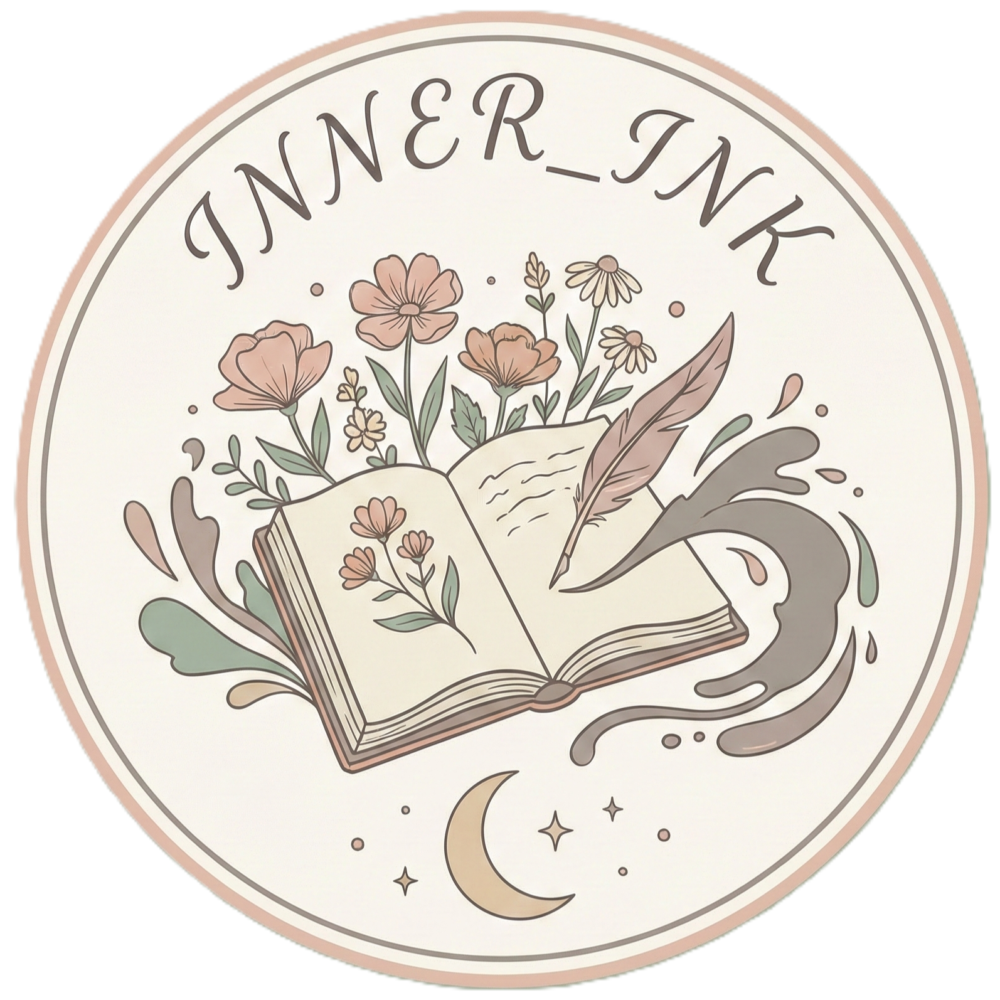

# ✍️ Inner Ink – Personal E-Diary Website

Inner Ink is a private, aesthetic e-diary website built using **HTML, CSS, and JavaScript**.  
It is designed to feel like a real personal diary where you can safely write daily thoughts, add moods, upload images, and save memories date-wise and time-wise in a beautiful, calming interface.

  

<h1 align="center">
  <a href="https://itsme-debapriya.github.io/INNER_INK-E-DIARY-PERSONAL-/">
    ✍️ Inner Ink – Personal E-Diary Website
  </a>
</h1>

---

## ✨ Features

- 🔐 **Password-protected login**
- 📅 **Date & time based diary entries**
- 😊 **Mood selection with emojis**
- 🖼️ **Image upload with preview**
- 💾 **Auto-save using localStorage**
- 🌸 **Aesthetic glassmorphism UI**
- ✨ **Smooth animations & glowing effects**
- 📱 **Responsive design (mobile friendly)**

---

## 🎨 Design Philosophy

The UI is inspired by:
- Real handwritten diaries
- Soft pastel colors
- Glassmorphism and blur effects
- Calm, emotional, and personal aesthetics  

The goal is to make the diary feel **private, comforting, and expressive**.
